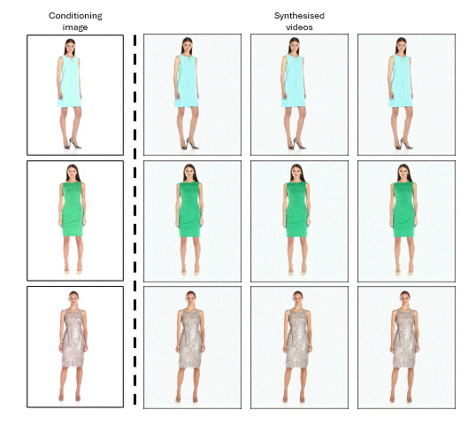

<div id="top"></div>

<h3>FashionFlow: Leveraging Diffusion Models for Dynamic Fashion Video Synthesis from Static Imagery</h3>

<p>
This repository has the official code for 'FashionFlow: Leveraging Diffusion Models for Dynamic Fashion Video Synthesis from Static Imagery'. 
We have included the pre-trained checkpoint, dataset and results.   
</p>

> **Abstract:** *Our study introduces a new image-to-video generator called FashionFlow to generate fashion videos. By utilising a diffusion model, we are able to create short videos from still fashion images. Our approach involves developing and connecting relevant components with the diffusion model, which results in the creation of high-fidelity videos that are aligned with the conditional image. The components include the use of pseudo-3D convolutional layers to generate videos efficiently. VAE and CLIP encoders capture vital characteristics from still images to condition the diffusion model at a global level. Our research demonstrates a successful synthesis of fashion videos featuring models posing from various angles, showcasing the fit and appearance of the garment. Our findings hold great promise for improving and enhancing the shopping experience for the online fashion industry.*

<!-- Results -->
## Teaser


## Requirements
- Python 3.8
- PyTorch 1.10+
- Tensoboard
- cv2
- transformers
- diffusers


## Installation

Clone this repository:

```
git clone https://github.com/1702609/FashionFlow
cd ./FashionFlow/
```

Install PyTorch and other dependencies:

```
pip install torch==1.10.2+cu113 torchvision==0.11.3+cu113 torchaudio===0.10.2+cu113 -f https://download.pytorch.org/whl/cu113/torch_stable.html
pip install -r requirements.txt
```

## Dataset

Download the Fashion dataset by clicking on this link: 
[[Fashion dataset]](https://www.dropbox.com/s/142kewkymaqwi2z/viton_hd_dataset.zip?dl=0)

Extract the files and place them in the ```fashion_dataset``` directory. The dataset should be organised as follows:

```
fashion_dataset
|-- 91-3003CN5S.mp4
|-- 91BjuE6irxS.mp4
|-- 91bxAN6BjAS.mp4
|-- ...
```

## Pre-trained Checkpoint

Download the checkpoint by clicking on this link: 
[[Pre-trained checkpoints]](https://www.dropbox.com/s/8q7mg1a7c8ci2ec/styleVTON_checkpoint.zip?dl=0) 
Extract the files and place them in the ```checkpoint``` directory

## Inference
To run the inference of our model, execute ```python inference.py```. The results will be saved in the ```result``` directory.